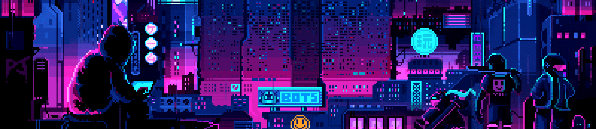

  
  
  

  
<b>Profile Views</b>

  

## 👨‍💻 About Me :

[Andrii Fatiuk](https://t.me/AndriiFatiuk). I’m actively working towards my interest in Web Development through self-study and pet projects. I have been dedicated to learning **JavaScript**,**TypeScript**, **React.js**, and **Next.js**, and I consistently practice and apply my knowledge by developing personal projects. Additionally, I possess proficiency in **HTML**, **CSS**, **Git**.

My project experience includes both team and individual projects, with roles as a team lead, managing a group of individuals. I have worked with **HTML5**, **CSS3**,  **SASS**, **JavaScript**, **TypeScript**, and **React.js** ensuring successful project execution.

As a team player with excellent communication skills, I value continuous learning and strive to stay up-to-date with the latest industry trends.

<h2></h2>

<h2 align="center"> Self-taught and passionate about coding! </h2> 

-   👨‍💻 I'm Andrii Fatiuk👋, a Softwear Engineer, I'm currently pursuing a Computer Science Degree in the Philippines.    

-   🌳 I’m currently learning Next.js and Node.js using JavaScript!    

-   🾠I’m looking to network and make friends here!    

-   🚀 2023 Goals: Front-end job, master front-end, learn backend basics, continue personal projects.    

-   ☕ Interest: Sports, Cars, Travel, and Coding.    

-    Hobbies: Powerlifting, Boxing, Racing, 3D Modelling, Extreme Cycling, and Linkedin.   

   

  
  
  
  <h2> <strong> ⚙️ Technologies and Skills </strong></h2>
   
  
  
   

  
   
  
  <h2></h2>
  <h3> <strong> Languages, Frameworks, and Tools </strong></h3>
  
    
  <h2></h2>
  <h3> <strong> Actively Learning </strong></h3>
  
   
  <h2></h2>
  <h3> <strong> Planning to Learn </strong></h3>
  &nbsp;
  

<h2></h2>

  <h2> <strong> 📚 My Languages </strong>  </h2>
   

  🌐 Languages : **🇺🇦Ukrainian - native** | **🇬🇧English - intermediate**

<h2></h2>
  
 

   <a href="https://www.codewars.com/users/Fatiuk">
 

## Roadmap 2023 :

✍️ - **Improve:** `HTML5` | `CSS3` | `JavaScript` | `React.js` | `TypeScript`  
📚 - **Learn:** `Next.js` | `Mobx.js `| `Node.js` | `React Native`  

## GitHub Stats :

<h2></h2>

  <h2> 🆠My Github Stats </h2> 
    <h2></h2> 
  
  

  

  

 

<h2></h2>

  <h2 align="center">👨‍💻 Projects </h2> 
  
  

 

<h2></h2>

  <h2 align="center">✉️ Contact </h2>
  
  &nbsp
  
  &nbsp
  
  &nbsp
  
  &nbsp
  

 

  
 
    
  

